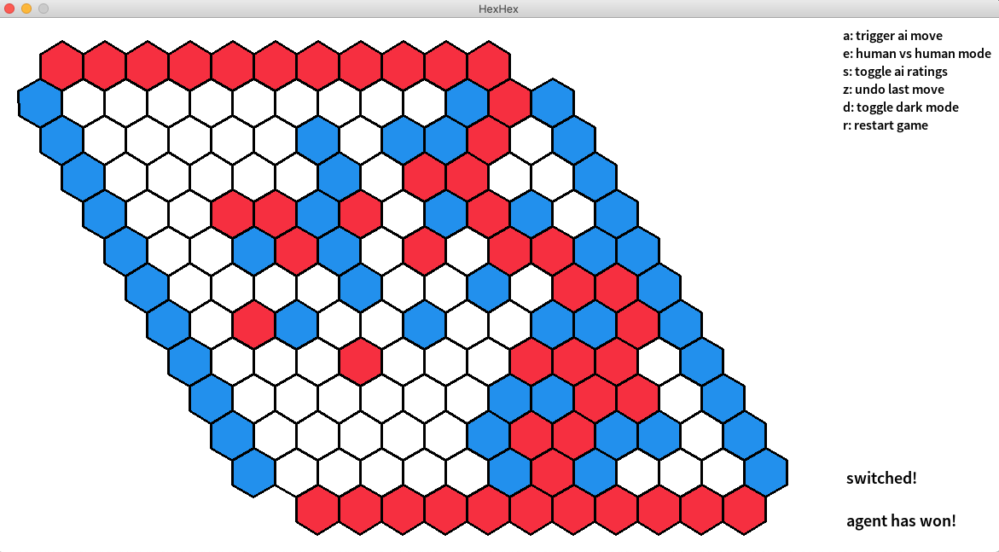

# HexHex

Reinforcement learning agent for the board game [hex](https://en.wikipedia.org/wiki/Hex_(board_game)) only trained by self-play.

Play online! https://cleeff.github.io/hex/

Finished game of Hex. Red won because she connected the two red rows on the top and bottom. We use the variant with allowed switching [Pie rule](https://en.wikipedia.org/wiki/Pie_rule).

Our agent uses a similar neural network architecture and training methods as used in AlphaGo Zero (Silver et al. (2017)). We were wondering how easy it would be to apply these techniques to Hex. On the way, we learned a lot about the details one might miss when simply reading the paper. Generally, it is fair to say that the techniques were very applicable to Hex and we were amazed how robust the deep learning RL framework is. We experimented with different model architectures and training schemes, but the simplest approach was often already working very well.

One observation that has been made by various people, is that the cost of training (i.e. updating weights) is relatively small compared to the [cost](https://www.yuzeh.com/data/agz-cost.html) of creating Monte Carlo Tree Search (MCTS) based self-play data. **To our surprise, it was possible to train a very strong agent without using MCTS**. This is certainly one of the most interesting outcomes of this project. We realized that training an MCTS agent would be prohibitively expensive. Instead of using a policy and value head as in AlphaGo Zero, we simply use a single head which, given the current board, outputs a rating for each possible move. The larger this number, the more likely it is that making this move will win the game. You can think of it as the output of the value head, but for every possible move. During self play, we use the softmax of this output with well tuned temperature to determine the next move. This allows to generate and train on millions of training positions generated by a single GPU within days. Our model uses 18 layers of convolutional neural networks (CNN) with 64 channels each. Each layer uses batch normalization and one direct skip connection. We tried different architectures but were quite pleased to find that this simple architecture already gave one of the best results.

We found that Hex is quite suitable for a reinforcement learning approach. First, similarly to Go there are no draws ([proof](https://en.wikipedia.org/wiki/Hex_(board_game)#Mathematical_theory)). This is a bit surprising at first and it is very helpful for training data generation because every game gives a non-zero reward for both players. This means that even random play at the beginning of training will generate a good signal (at least for the last few moves) right from the start. Second, the length of a game is upper bounded by the number of fields on the board, as opposed to e.g. Chess. Both facts meant that the agent improved from random play to novice level very quickly. Interestingly, just learning evaluations from random play without any feedback loops gives ratings which intuitively make sense. Probably this means that in Hex, the move which maximizes your chance of winning under subsequent random play is a fairly good choice.

We found it difficult to train the agent to quickly end a surely won game. When you play against the [agent](https://cleeff.github.io/hex/) you'll notice that it will not pick the quickest path to victory. Some people even say it's playing mean ;-) Winning quickly simply wasn't part of the objective function! We found that penalizing long routes to victory either had no effect or degraded the performance of the agent, depending on the amount of penalization. Probably we haven't found the right balance there.

One interesting problem we found on the way was evaluating the relative strengths of agents. When playing at best agent performance, i.e. temperature set to 0 in the softmax function, the agents plays deterministically. Thus, having two agents play 100 games against each other will result in 100 identical games! This can be solved by picking a positive temperature in the softmax (effectively weakening the agents) or playing all one or two move openings. Both feel like an artificial constraint to the agents or the game. We were not able to determine which strategy Silver et al. have chosen to tackle this problem.

Want to train your own agent? Have a look [here](hexhex/README.md).

Feel free to [get in touch](https://github.com/cleeff) if you have any comments or questions!